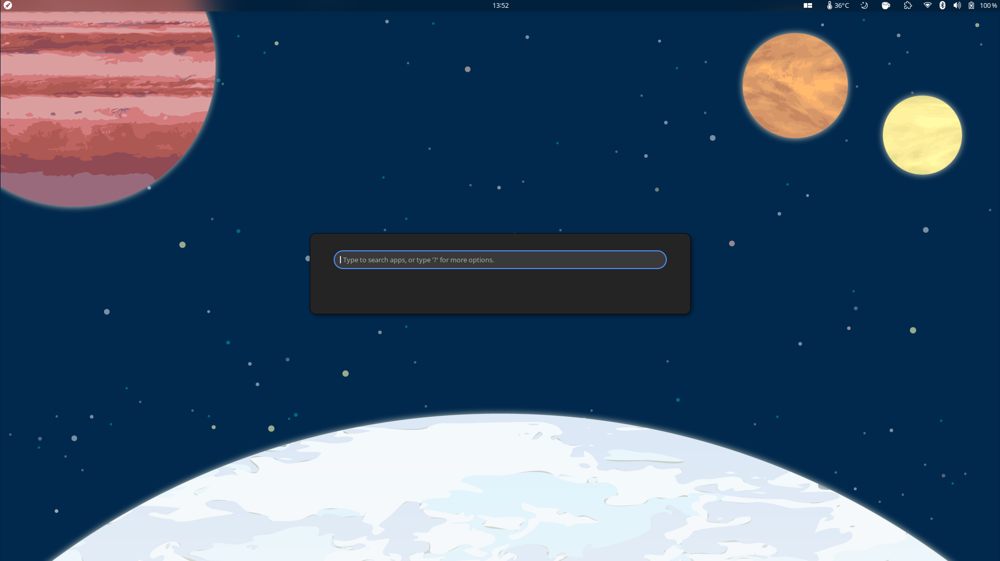

# Pop!_OS Launcher on Super-Key



Fork of [Pop COSMIC](https://github.com/pop-os/cosmic) that binds the Pop Launcher to the ```Super```-Key (Without ```Super+/```).

## Requirements
* [GNOME Shell](https://gitlab.gnome.org/GNOME/gnome-shell) == 3.38.*
* [Pop_Shell](https://github.com/pop-os/shell) >= 1.1.0
* [Pop-Launcher](https://github.com/pop-os/launcher)


## Installation 

[](https://extensions.gnome.org/extension/4797/pop-launcher-super-key/)

* ### From Source

    ```
    git clone https://github.com/ManeLippert/pop-launcher-super-key
    cd pop-launcher-super-key
    make && make install
    killall -3 gnome-shell
    ```
* ### From Release
    Download release-file, unzip it and move it to ```~/.local/share/gnome-shell/extensions/```


    After that reboot your PC or hit **'Alt+Fn+F2'** and type **'r'** or type in the terminal ```killall -3 gnome-shell```

## Removal

```
rm -r ~/.local/share/gnome-shell/extensions/pop-launcher-super-key@ManeLippert
```

## License
COSMIC is available under the terms of the GNU General Public License Version 3. For full license terms, see [LICENSE](./LICENSE).
